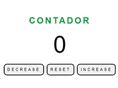
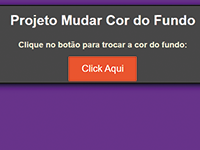
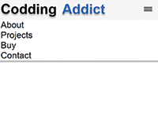
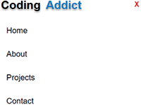

# PROJETOS para treinar usando HTML, CSS e JAVASCRIPT

## Conjunto de projetos FRONT-END para exercitar funções, ideias e reforçar certos conceitos.

A ideia por trás desses projetos é reforçar uma base previamente construída, e aprender sempre que possível ao decorrer do desenvolvimento dos projetos. No momento, sem usar nenhum Framework visando experienciar as estruturas e conceitos de estilização, além da lógica para manipulação do DOM, sem nenhum atalho.

## Fonte das ideias de projetos:

👁️‍🗨️ 1- Site de 40 projetos no FreeCodeCamp:

<a href="https://www.freecodecamp.org/portuguese/news/40-projetos-em-javascript-para-iniciantes-ideias-simples-para-comecar-a-programar-em-js" target="_blank">  </img> </a>

## Conceitos à melhorar:

- ⭕ <b>Melhorar o uso semântico no HTML</b>

(basicamente parar de usar 999x Divs. USA O MALDITO HEADER!!!!).

- ⭕ <b>Reduzir o uso de classes MUUITO específicas</b>.

Entendi que dificulta muito reusar uma classe em outro processo que poderia ter o mesmo estilo/função, mas pela nomeclatura imposta fica nada intuitivo, as vezes até confunde. E acabo criando muitas classes, para uma maldita div (podia usar ID logo né?!!!), poluindo muito o CSS e JS do projeto.

## Existe um vídeo guia de entendimento de como realizar esses projetos:

<a href="https://www.youtube.com/watch?v=3PHXvlpOkf4&t" target="_blank">  </img> </a>

⚠️ Vídeo usado apenas como guia para momentos em que ficar MUUITO travado, e nem souber O QUE pesquisar na net (ainda não me ocorreu 🙏). Em outros casos uso para saber detalhadamente o que é para ter no projeto, já que a descrição no site (1) abrange o projeto de uma forma mais geral.

## Como visualizar esses projetos:

Atualmente a única maneira é baixando os arquivos e executando em sua máquina (sorry).
Ainda não aprendi como realizar deploy, mas assim que aprender colocarei aqui para cada projeto meu.

✔️ <b>Aprender a fazer deploy dos projetos.</b>

Por enquanto estão aqui:

<!-- [projeto1](counter/) -->
